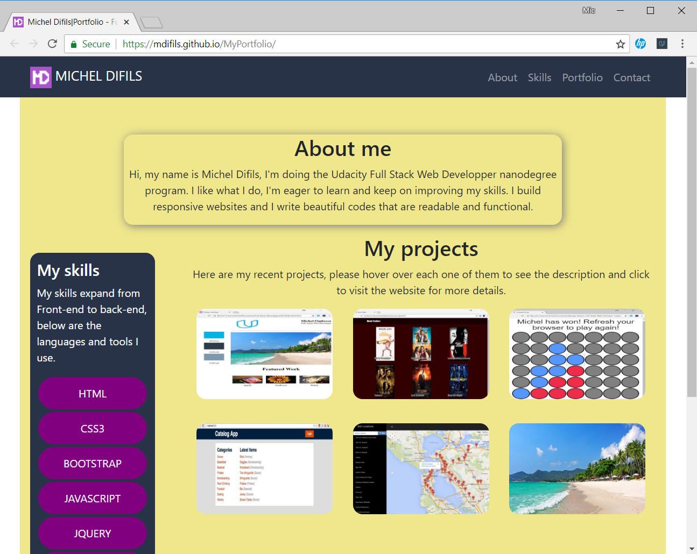

# My Portfolio

As a Web Developer, having a portfolio is very important. It's a way to show
you who am I, what are my skills and how do I use them in real life. So Have a look
to some of my projects and enjoy.

## Preview

## See more

To see more, please visit my [website](https://mdifils.github.io/MyPortfolio/)

### Code  
To have a glance to the code, please check the files: index.html and css/style.css
